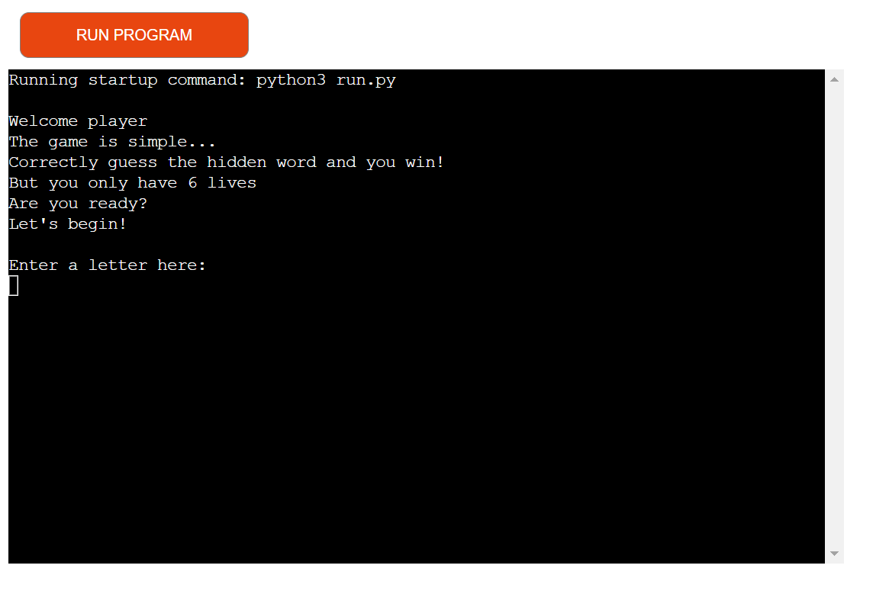
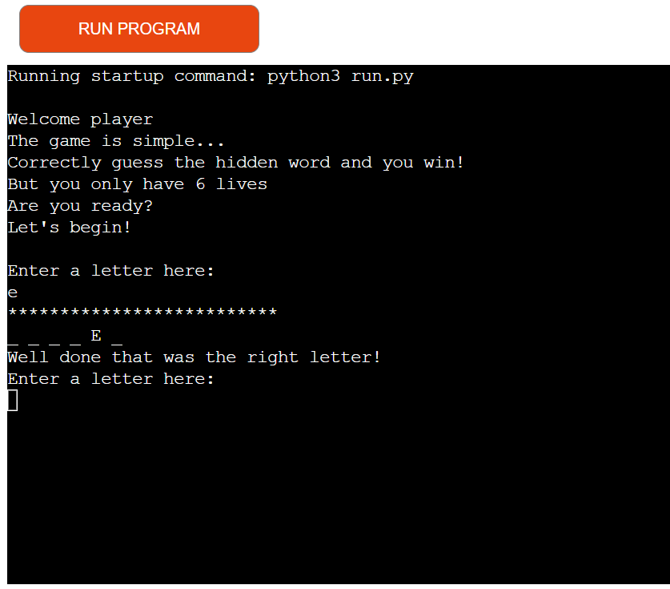
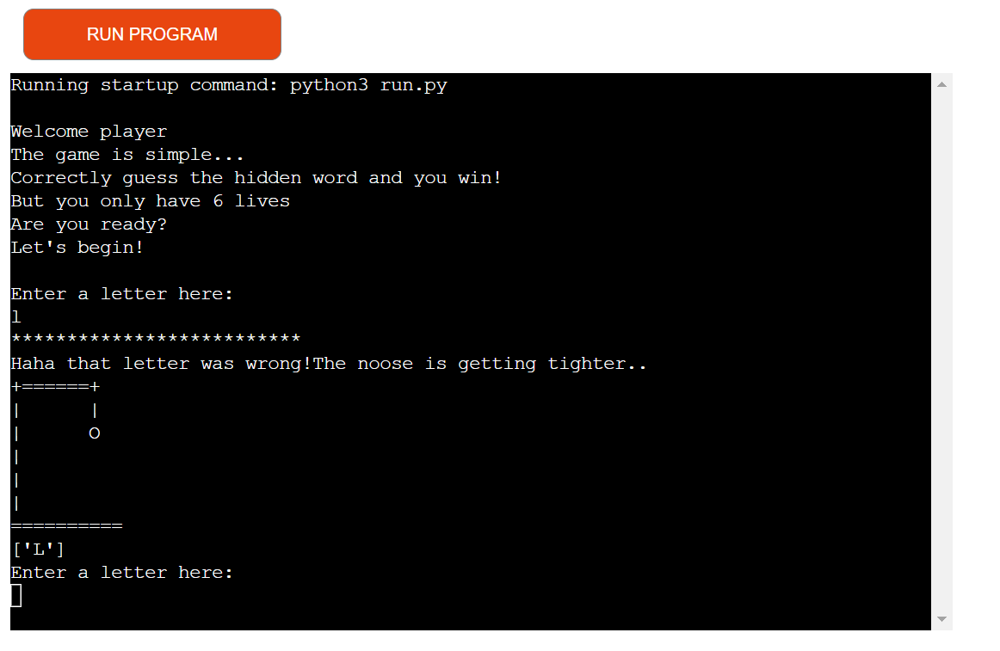
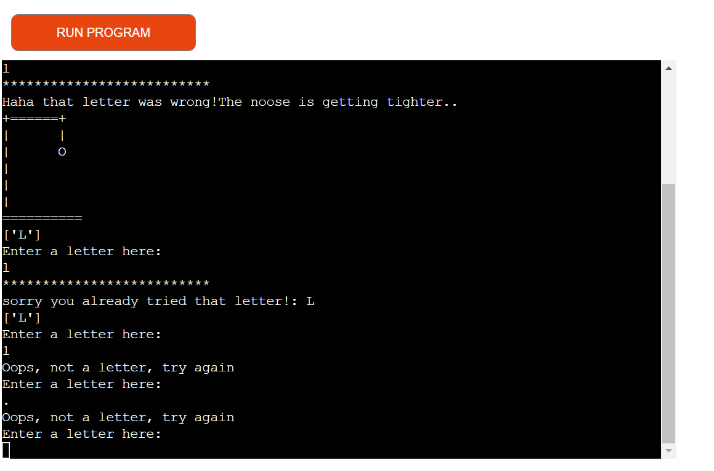
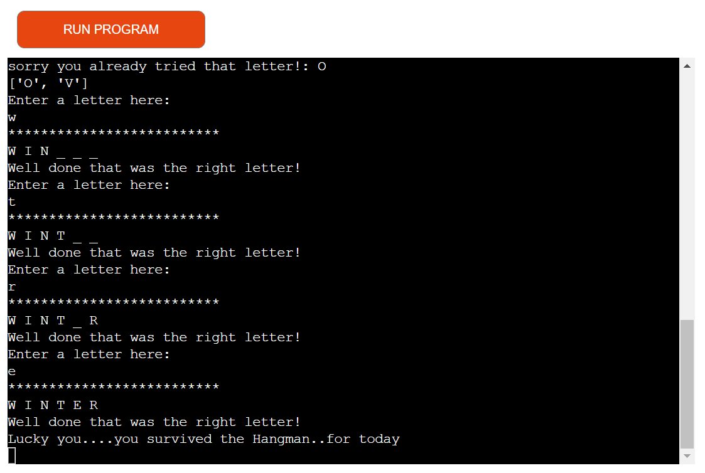
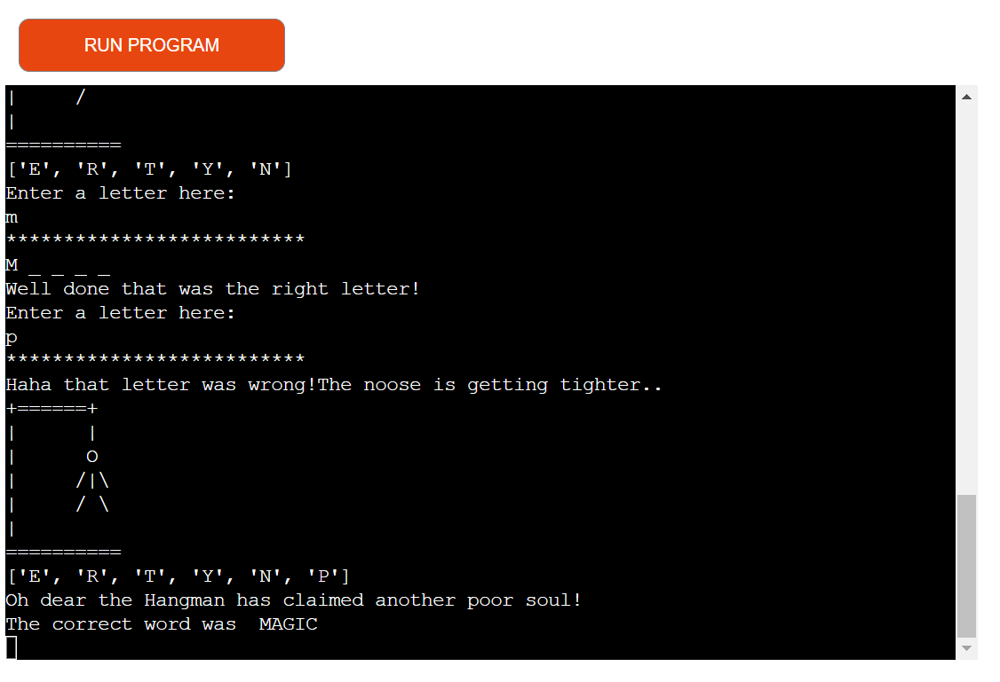
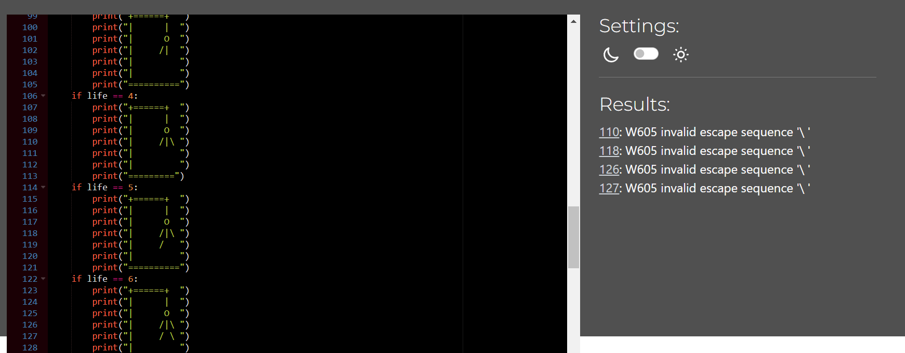

# HANGMAN GAME

Hangman is a guessing game, guess the hidden word and you win, but if you can't guess the hidden word you loose. With only 6 lives this game is made a bit more challenging. The user must choose carefully in order to reveal the hidden word before they loose all their lifes.

The link to the live site can be found here, enjoy!- [Hangman](https://hang-man-game.herokuapp.com/)

## Table of Contents  
* [Features](#features)  
* [Testing](#testing)
* [Bugs](#bugs)
* [Validator Testing](#validator-testing)
* [Deployment](#deployment)
* [Credits](#credits)

# Features
ENTER SCREENSHOTS HERE

The first messages the user will see when the page is loaded is the player welcome message. This welcomes the user to the game hangman and explains the rules. 
Underneath this welcome message will be another message for the user which will say "Enter a letter here". This will give the user clear indication that they can now enter a letter and the game has begun.  

Entering a correct letter will result in a display message "Well done that was the right letter". The correct letter will be shown on the terminal with the remaining hidden letters shown by an underscore "_". The user can use this as a way to see how many letters are in the word they have to guess and what letter might be worth picking next.

Entering an incorrect letters will result in the incorrect letter showing on the screen and the hangman peice to appear indicating the a life lost/wrong guess. Each letter wrong is another peice to the hangman display. The user will only have 6 attempts to guess the hidden word.

Entering a letter that the user has already got wrong will result in a message "sorry you already tried that letter" No life is lost and the user can now choose another letter.
Entering any number or symbol will result in an "oops, not a letter, try again" message. Entering more than one letter at a time will result in a message "please enter one letter at a time". This will not effect the users life count.

Once all the correct letters have been entered and the hidden word has been reveled the message will print to the terminal with a winner message.

Loosing the game will result in a lose message and a message which will tell the user what the correct hidden word was. So the user will always finish knowing what the hidden word was. 

For future features I would like to add a lives count to the terminal so the user can keep tabs on how many lives they have left. 
I would also like to add some visuals like a large Hangman title at the top of the terminal and once a game has been won or lost a "Winner" or "Gameover" display. I think that would make it look better and more visually pleasing as I feel it comes across as a little bland. 

# Testing
The game was tested in the Github terminal while writing code and once ready for deployment was tested on the deployed site Heroku. Family and friends tested out the game on the live site. 

# Bugs

* The word that was chosen at random was showing on the terminal. I had forgot to remove the print statment put in earlier and once removed the random word was no longer showing on the terminal. The user will not see the random word now this has been fixed.

* Numbers and symbols were still allowed to be entered to the terminal and the user would loose a life. I fixed this by adding a function valid_entry and also placing this function in my main while loop. This now means that anything that is not a letter will not be accepted (no life will be lost) and a message will show telling the user that this is not a letter and that they should try again.

* Hangman display was not loading to terminal when wrong letter was entered I fixed this by placing this inside a function and placing print statements arouund the displays and also adding hangman(len(wrong_guess) to my wrong guesses if statement. I had also forgot to place a break after my if statement for loosing the game it wasn't ending when lost. 

* Each turn was stacking ontop of one another and looked a bit messy. I fixed this by adding a print statement with ==== at first but I didn't like how this looked so I changed it for *** instead, I found it looked better.

* Guesses that were entered were lowercase instead of uppercase so I added upper onto my input method and this fixed the problem.

* More than one letter was still allowed to be entered with the user loosing a life. I partially got to fixing this. I created an if statement so that if the letter entered was more than one entry a message would print to the terminal saying that the user should enter one letter at a time. Once I had done this I tested it out but the game would exit after more that one letter had been entered. I fixed this by removing the break that I had left on the end of my if statement. Once removed the game continued like expected. This is a bug that I have to leave as unfixed because I do not have enough time left. But if the user does enter more than one letter at a time they will be told to enter one letter at a time but also loose a life.

# Validator Testing
Using PEP8 Python Validator, the only error left that I after correcting the rest was "ERROR: W605 invalid escape sequence '\ '". Only the hangman displays with the backslash in were effected.

# Deployment
Following the steps that Code Insitute have shown.
I Entered a new line character to the end of my text input method otherwise this will not work on the mock terminal. I enter pip3 freeze > requirements into the terminal. Nothing was loaded into the terminal because I have not used any other software. I then push any unsaved changes from my work to github.
From Heroku I click create new app, I then named my app hang-man-game, I selected my region and then clicked create app.
Once the page loaded I went into the settings tab, I went to the config vars section and entered PORT to the key and 8000 to the value (this was added because the mock terminal may fail and the project will not work if not entered). I haven't used a creds.json file so I will not be adding the config var that love sandwiches project did.
I then scrolled down to the buildpacks section, I clicked add buildpack and selected python then click saved changes. I then clicked back on buildpack and selected node.js then click saved changes again. I made sure that Python was first and then node.js.
Next I went to the deployment section and select my deployment method which is github. I confirmed that I wanted to connect to github. I searched for my respositry name which is Hangman. I selceted this and then connected to link the heroku app to my reposity code.
I then scrolled down and clicked deploy branch from the deploy a github branch (this way showed me the logs being run as my project was being deployed). 
Once completed I then clicked on view to view my deployed project on the terminal.
It loaded with no errors. I then tested my project making sure everything was working as it should and it was.

# Credits
All these tutorials helped me to further my understanding of python and also inspired my project.

1. Tutorial-[Tech With Mike](https://www.youtube.com/channel/UCnvj-t_xNcB0ap82KoEm8mQ)
2. Tutorial-[Kylie Ying](https://www.youtube.com/watch?v=cJJTnI22IF8)
3. Tutorial-[Shaun Halverson](https://www.youtube.com/watch?v=pFvSb7cb_Us)
4. Tutorial-[Kite](https://www.youtube.com/watch?v=m4nEnsavl6w)
5. Tutorial -[StudentEngineer](https://www.youtube.com/watch?v=TWLD2OKmSCQ)